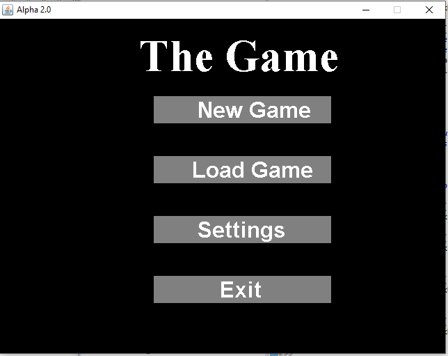
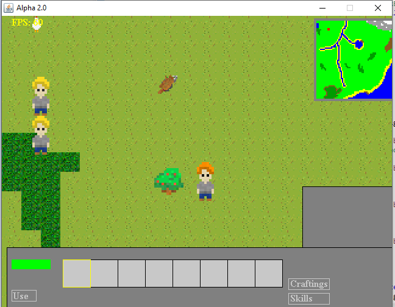
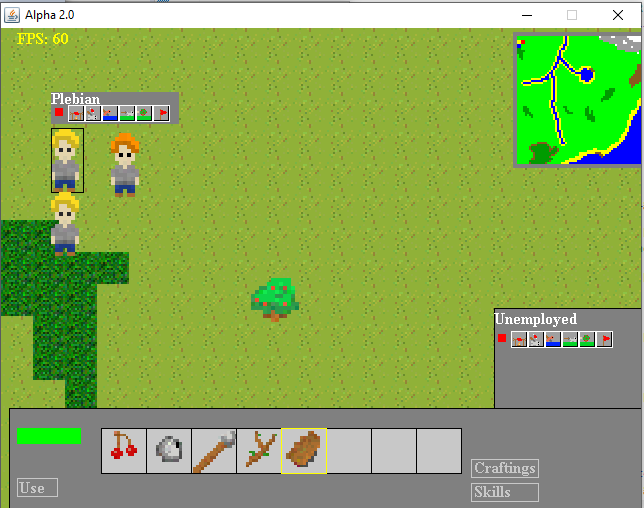
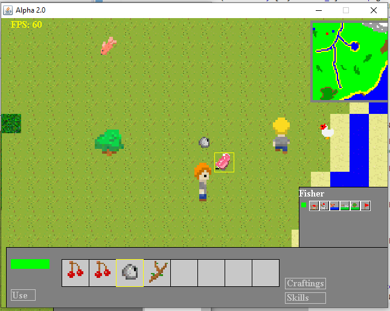
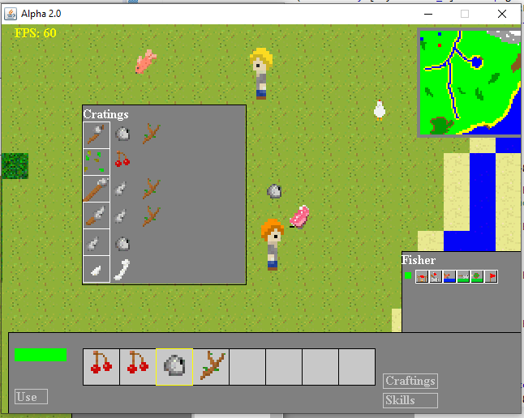
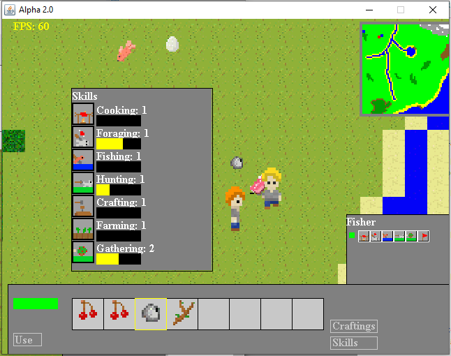

# Java2dRPG

A 2D Role Survival RPG (Role Playing Game) made in Java. Build with Java Swing and AWT. The game is updated and rendered in a thread separate from the main thread which handles the application window. The game is updated and rendered at 60 calls a second.

When the game starts, the user can view the menu page which hold custom built buttons that high light when the mouse hovers over them. The user can go to "Settings", "Load" and "Play" pages and navigate back to the menu page.

In the Play page, the user controls a character with the WASD keys. The character has a 3 frame animation for each direction. The user can move the character to nearby items by moving the character near the item and clicking on the item. The item will highlight when the mouse hovers over it. On the top left corner is a mini map which shows the map terrain, the player’s position with a red dot and recruited AI position with a blue dot. The terrain is made up of several terrain such as grass, trees, water that blocks the player from moving, sand, snow, rock, dirt, and tilled earth.

With the picked up items, the user can have different actions. Fish can be caught in the water when a spear is in the inventory, and rocks can be thrown at chickens with the spacebar to gather feathers, bones, and meat. Sticks can be turned into hire when a rock is in the inventory which can be used to cook fish and meat. With the cooked food, the user can give food to nearby AI to recruit them. The recruit AI can be assigned jobs such as Fish, Cook, Gather, and Hunt. Gathered items can also be crafted with the crafting menu.

Certain tasks such as fishing, cooking, tilling the ground will give the player experience in their skills which can be viewed in the Skill menu.

All images are loaded from Springs.png sprite sheet. The map is generated from Map.png where each pixel color represents a terrain tile.

The application is still in an early iteration. Future updates involves:
* Implementing configurable settings
* Implementing saving and loading
* Organize and optimize code for reusability and maintainability
* Game instructions
* More intuitive gameplay
* Better AI controls
* Building of structures 
* Benefits of skills such as better drop rates
